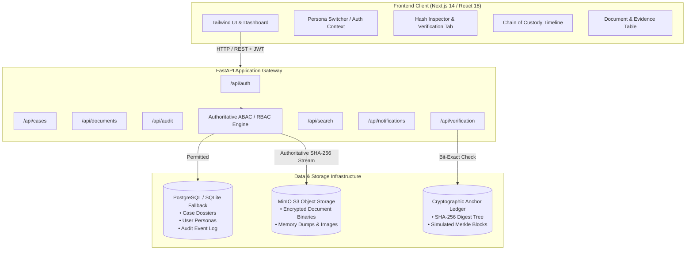

# CASETRACE: Secure Digital Case Passport & RBAC Infrastructure

<div align="center">


**A Cryptographically Verifiable, Multi-Agency Digital Evidence & Case Governance System for Law Enforcement, Forensics, and Judiciary**

[](https://nextjs.org/)
[](https://fastapi.tiangolo.com/)
[](https://www.python.org/)
[](https://www.typescriptlang.org/)
[](https://www.postgresql.org/)
[](https://min.io/)
[](https://tailwindcss.com/)
[-brightgreen?style=flat-square&logo=pytest&logoColor=white)](https://docs.pytest.org/)
[](#license)

</div>

---

## 📌 Table of Contents

- [Executive Summary](#executive-summary)
- [Core Architectural Principle](#core-architectural-principle)
- [System Architecture](#system-architecture)
- [Key Features](#key-features)
- [Multi-Agency RBAC & Clearance Matrix](#multi-agency-rbac-clearance-matrix)
- [Technology Stack](#technology-stack)
- [Project Directory Structure](#project-directory-structure)
- [Prerequisites](#prerequisites)
- [Getting Started & Installation](#getting-started-installation)
  - [1. Clone Repository](#1-clone-repository)
  - [2. Backend Configuration & Setup](#2-backend-configuration--setup)
  - [3. Object Storage Setup (MinIO / S3)](#3-object-storage-setup-minio--s3)
  - [4. Frontend Configuration & Setup](#4-frontend-configuration--setup)
- [Environment Variables Guide](#environment-variables-guide)
- [API Reference & Documentation](#api-reference--documentation)
- [Verification & Testing Suite](#verification--testing-suite)
- [Demo Personas & Evaluation Walkthrough](#demo-personas--evaluation-walkthrough)
- [Security & Cryptographic Guarantees](#security--cryptographic-guarantees)
- [License & Acknowledgments](#license-acknowledgments)

---

<a id="executive-summary"></a>
## 🏛 Executive Summary

Digital evidence management in criminal justice faces critical systemic challenges:
1. **Evidence Tampering & Repudiation:** Absence of instantaneous, mathematical integrity verification across handoffs.
2. **Chain-of-Custody Breaches:** Lack of an authoritative, immutable chronological audit ledger between agencies.
3. **Cross-Agency Information Leaks:** Uncontrolled sharing where sensitive forensic disk dumps or classified intelligence are exposed to unauthorized personnel.
4. **Inter-Agency Friction:** Disconnected silos between First Responders (Police), Digital Forensics Laboratories, Public Prosecutors, and the Judiciary.

**CASETRACE** addresses these vulnerabilities by establishing an authoritative **Digital Case Passport**. Each investigation is anchored with a cryptographically verified dossier where physical evidence binaries, cryptographic checksums, and granular multi-level clearance rules coexist seamlessly. Access decisions are evaluated dynamically server-side based on:
$$\text{Access Granted} \iff f(\text{User Role}, \text{Case Assignment}, \text{Document Sensitivity}, \text{Purpose of Access})$$

---

<a id="core-architectural-principle"></a>
## 🛡 Core Architectural Principle

> ### **ONE CASE → ONE DIGITAL CASE PASSPORT → MULTIPLE SECURE VIEWS**
>
> An investigation is initialized once and issued a cryptographically anchored Digital Case Passport. Every officer, forensic analyst, prosecutor, and court clerk inspects the **same authoritative source of truth**, but receives a **dynamically filtered, role-tailored view** enforced authoritatively by backend policy.

```
                  ┌────────────────────────────────────────────────────────┐
                  │                 DIGITAL CASE PASSPORT                  │
                  │   Case ID: CASE-2026-8942 • Ledger Anchor: 0x8f2a...   │
                  └──────────────────────────┬─────────────────────────────┘
                                             │
               ┌─────────────────────────────┼────────────────────────────┐
               ▼                             ▼                            ▼
     [ Senior Officer View ]       [ Forensic Officer View ]     [ Court Registry View ]
     • Cross-Department Scope      • Bit-Exact Hash Inspector    • Public Docket Filings
     • Evidence Registration       • Raw Disk Images / Telemetry • Redacted Court Briefs
     • Global Audit Ledger         • Merkle Ledger Anchors       • Read-Only Clearance
```

---

<a id="system-architecture"></a>
## 🏗 System Architecture

CaseTrace decouples physical document binary storage from relational metadata and cryptographic anchoring, ensuring zero-trust verification and defense-in-depth:



### Document Ingestion & Verification Pipeline

```
┌─────────────────┐       ┌─────────────────┐       ┌─────────────────┐       ┌─────────────────┐
│ Document Upload │  ──►  │ Server SHA-256  │  ──►  │ MinIO S3 Bucket │  ──►  │ PostgreSQL DB   │
│ (Multipart)     │       │ Checksum Engine │       │ Physical Binary │       │ Metadata & ACL  │
└─────────────────┘       └─────────────────┘       └─────────────────┘       └─────────────────┘
                                                                                       │
┌─────────────────┐       ┌─────────────────┐       ┌─────────────────┐                ▼
│ Immutability    │  ◄──  │ Purpose/Policy  │  ◄──  │ Mediated Stream │       ┌─────────────────┐
│ Audit Log Entry │       │ Gatekeeper      │       │ Or Download     │  ◄──  │ Blockchain /    │
└─────────────────┘       └─────────────────┘       └─────────────────┘       │ Ledger Anchor   │
                                                                              └─────────────────┘
```

---

<a id="key-features"></a>
## ✨ Key Features

### 1. Unified Digital Case Passport
- Comprehensive case docket encapsulating incident timelines, lead investigators, suspects, victims, jurisdictional stage, and cryptographic anchors.
- Instant overview of case clearance levels (`PUBLIC`, `INTERNAL`, `CONFIDENTIAL`, `TOP_SECRET`, `RESTRICTED`).

### 2. Multi-Agency RBAC & ABAC Policy Engine
- Access is not merely a boolean flag; it is evaluated dynamically on:
  - **User Role**: Hierarchical permissions across 7 specialized justice roles.
  - **Case Assignment**: Users must be assigned to the specific case (unless holding cross-department oversight clearance).
  - **Document Sensitivity**: Strict clearance bounds (`PUBLIC` up to `TOP_SECRET` and `FORENSIC`).
  - **Purpose of Access**: Mandatory justification logging for privileged downloads and inspections.

### 3. Cryptographic Tamper Detection & Verification
- Authoritative server-side **SHA-256 digest computation** upon upload.
- On-demand **Bit-Exact Integrity Verification** comparing stored ledger digests with active object bytes.
- Visual Hash Inspector highlighting character-by-character mismatches and issuing immediate tamper alerts.
- Simulated blockchain block heights, Merkle root verification, and immutable transaction hashes.

### 4. Immutable Chain of Custody (CoC) & Audit Ledger
- Granular event logging recording: `Actor`, `Clearance`, `Action`, `Resource ID`, `Timestamp`, `Purpose`, `Risk Level`, and `IP Telemetry`.
- Non-repudiation: Audit logs are append-only; historical blocks cannot be retroactively updated or purged.

### 5. Secure Binary Object Storage (MinIO / S3)
- Physical isolation of file payloads in MinIO S3 buckets with authoritative server mediation.
- Zero direct, unauthenticated bucket access.
- Support for large forensic binaries (raw disk images, memory dumps, surveillance archives).

### 6. Deep Forensic Search & Discovery
- Unified search engine indexing:
  - Case numbers (e.g., `CASE-2026-8942`)
  - Document & file names
  - Evidence tracking IDs (e.g., `EV-7788-001`)
  - Partial & full 64-character SHA-256 hex digests

### 7. Real-Time Security Notifications & Telemetry
- Automated notifications dispatched on evidence registration, integrity verification, and access denials.
- Actionable deep-links directing officers straight to the pertinent Case Passport tab.

---

<a id="multi-agency-rbac-clearance-matrix"></a>
## 👥 Multi-Agency RBAC & Clearance Matrix

| Role | Demo Persona | Department | Clearance Level | Permitted Sensitivities | Core Capabilities | Prohibited Actions |
| :--- | :--- | :--- | :--- | :--- | :--- | :--- |
| **Senior Officer** | Cmdr. Robert Vance | Executive Crime Command | `TOP SECRET // EXECUTIVE` | `PUBLIC`, `INTERNAL`, `CONFIDENTIAL`, `TOP_SECRET`, `FORENSIC` | Create cases, upload evidence, verify hashes, cross-department oversight | Tamper with historical audit ledger, falsify SHA-256 digests |
| **Investigating Officer** | Insp. Sarah Jenkins | Financial Crimes Division | `CONFIDENTIAL // LEAD` | `PUBLIC`, `INTERNAL`, `CONFIDENTIAL` | Manage assigned cases, upload evidence, file investigative reports | Access unassigned cases, view `TOP_SECRET` or `FORENSIC` disk dumps |
| **Forensic Officer** | Dr. Alex Mercer | Digital Forensics Lab | `SPECIAL ACCESS // FORENSIC` | `PUBLIC`, `INTERNAL`, `FORENSIC` | Bit-exact verification, memory dump analysis, raw image registration | Access unassigned criminal cases, create new cases, modify audit logs |
| **Prosecutor** | Atty. Marcus Thorne | Public Prosecutions | `LEGAL PRIVILEGE` | `PUBLIC`, `INTERNAL`, `CONFIDENTIAL` | Inspect chain of custody, review trial exhibits, verify admissibility | Access unassigned cases, view raw `FORENSIC` dumps, delete evidence |
| **Court User** | Clerk Helen Ross | High Court Registry | `PUBLIC REGISTRY` | `PUBLIC` | Inspect public docket, view unsealed evidence, verify public filings | Access `CONFIDENTIAL` / `FORENSIC` records, upload files, modify cases |
| **Auditor / Security** | David Chen | Internal Affairs & Oversight | `FULL COMPLIANCE // AUDIT` | All Sensitivities (Oversight View) | Global audit inspection, compliance reporting, tamper alert monitoring | Upload evidence, alter filings, delete audit logs (strictly read-only) |
| **Admin** | Elena Rostova | IT Directorate | `ROOT GOVERNANCE` | All Sensitivities (Governance) | System configuration, user management, administrative purge with audit | Falsify cryptographic verification, alter chained audit blocks |

---

<a id="technology-stack"></a>
## 💻 Technology Stack

### Frontend Application
- **Framework:** [Next.js 14](https://nextjs.org/) (App Router, Server & Client Components)
- **Language:** [TypeScript 5.6](https://www.typescriptlang.org/)
- **UI & Styling:** [Tailwind CSS 3.4](https://tailwindcss.com/) with dark/light mode support
- **Icons:** [Lucide React](https://lucide.dev/)
- **State & Auth:** React Context (`AuthContext`) with seamless role simulation

### Backend Application
- **Framework:** [FastAPI](https://fastapi.tiangolo.com/) (Asynchronous ASGI Python Web Framework)
- **Database ORM:** [SQLAlchemy 2.0](https://www.sqlalchemy.org/)
- **Schema Validation:** [Pydantic v2](https://docs.pydantic.dev/) & `pydantic-settings`
- **Database Migrations:** [Alembic 1.13+](https://alembic.sqlalchemy.org/)
- **Security & Tokens:** Python-Jose (JWT), Passlib & Bcrypt
- **Object Storage SDK:** [Boto3](https://boto3.amazonaws.com/v1/documentation/api/latest/index.html) (S3-compatible API client)

### Databases & Infrastructure
- **Relational Storage:** [PostgreSQL](https://www.postgresql.org/) (production) with automated zero-configuration [SQLite](https://www.sqlite.org/) fallback
- **Object Storage:** [MinIO](https://min.io/) S3-compatible high-performance object storage
- **Testing:** [Pytest 8.3+](https://docs.pytest.org/), HTTPX

---

<a id="project-directory-structure"></a>
## 📁 Project Directory Structure

```plaintext
CaseTrace/
├── README.md                      # Comprehensive project documentation
├── casetrace.db                   # Local SQLite database (automatic dev fallback)
│
├── Frontend/                      # Next.js 14 Frontend Application
│   ├── package.json               # Node.js dependencies & scripts
│   ├── tsconfig.json              # TypeScript compiler configuration
│   ├── tailwind.config.ts         # Tailwind CSS styling configuration
│   ├── next.config.js             # Next.js runtime configuration
│   ├── .env.example               # Frontend environment template
│   └── src/
│       ├── app/                   # Next.js App Router
│       │   ├── page.tsx           # Gateway & Persona Selector Landing Page
│       │   ├── layout.tsx         # Root layout with theme & auth providers
│       │   ├── globals.css        # Core design tokens & glassmorphism utilities
│       │   └── dashboard/         # Dashboard Views
│       │       ├── page.tsx       # Main analytics & investigation hub
│       │       ├── cases/         # Case Passport & detail views ([id])
│       │       ├── verification/  # Cryptographic Hash Inspector view
│       │       ├── audit/         # Global Audit Log & Security Stream
│       │       └── admin/         # Administrative Governance console
│       ├── components/            # Modular UI Components
│       │   ├── common/            # Navbar, Sidebar, Modals, Status Badges
│       │   ├── passport/          # Digital Case Passport tabs & modals
│       │   ├── security/          # Access audit logs, Risk scorecards
│       │   └── verification/      # Hash inspectors, Ledger timeline
│       ├── context/               # React Context (AuthContext)
│       ├── services/              # API Client & Backend communication
│       └── types/                 # TypeScript interfaces (RBAC, Case, Document)
│
└── backend/                       # FastAPI Backend Application
    ├── requirements.txt           # Python dependencies
    ├── alembic.ini                # Alembic database migration configuration
    ├── pytest.ini                 # Pytest configuration
    ├── .env.example               # Backend environment template
    ├── alembic/                   # Database migrations
    │   └── versions/              # Migration scripts (001, 002, 003)
    ├── app/
    │   ├── main.py                # FastAPI application entrypoint & lifespan
    │   ├── api/routes/            # REST API route handlers
    │   │   ├── auth.py            # Authentication & persona profiles
    │   │   ├── cases.py           # Case dossier creation & management
    │   │   ├── documents.py       # Object upload, mediated download & deletion
    │   │   ├── verification.py    # Bit-exact SHA-256 hash verification
    │   │   ├── audit.py           # Immutable audit log queries
    │   │   ├── dashboard.py       # Dashboard statistics & recent telemetry
    │   │   ├── search.py          # Unified multi-parameter search engine
    │   │   ├── notifications.py   # Security notifications & deep-links
    │   │   └── health.py          # Health check & connectivity diagnostics
    │   ├── core/                  # Configuration & security utilities
    │   ├── db/                    # SQLAlchemy database engine, models & seed
    │   │   ├── models/            # Case, Document, User, Audit, Access models
    │   │   └── seed.py            # Demo database seeder (users, cases, docs)
    │   ├── schemas/               # Pydantic request/response schemas
    │   └── services/              # Business logic (Access Control, Storage, Audit)
    └── tests/                     # 16 Comprehensive Pytest test suites
```

---

<a id="prerequisites"></a>
## ⚙️ Prerequisites

Ensure you have the following installed on your machine:
- **Node.js**: `v18.17.0` or later ([Download Node.js](https://nodejs.org/))
- **Python**: `3.10` or later ([Download Python](https://www.python.org/))
- **Package Managers**: `npm` (bundled with Node) and `pip` (bundled with Python)
- **Object Storage (MinIO)** *(Optional for full S3 binary testing, native binary or Docker)*

---

<a id="getting-started-installation"></a>
## 🚀 Getting Started & Installation

### 1. Clone Repository

```bash
git clone https://github.com/sarangugemuge/CaseTrace.git
cd CaseTrace
```

---

### 2. Backend Configuration & Setup

#### A. Create and Activate Virtual Environment

**On Windows (PowerShell):**
```powershell
python -m venv .venv
.\.venv\Scripts\Activate.ps1
```

**On Linux / macOS:**
```bash
python3 -m venv .venv
source .venv/bin/activate
```

#### B. Install Dependencies
```bash
pip install -r backend/requirements.txt
```

#### C. Configure Environment Variables
Copy the backend environment template:
```bash
# Windows PowerShell:
Copy-Item backend/.env.example backend/.env

# Linux / macOS:
cp backend/.env.example backend/.env
```

> 💡 **Zero-Configuration Fallback:** If PostgreSQL is not running locally, CaseTrace automatically falls back to an embedded SQLite database (`casetrace.db`). No configuration is required to test immediately!

#### D. Run Migrations & Seed Sample Data
```bash
# Run database schema migrations
alembic upgrade head

# Seed 7 demo personas, 3 multi-jurisdiction cases, and verified documents
python -m backend.app.db.seed
```

#### E. Start FastAPI Backend Server
```bash
uvicorn backend.app.main:app --host 127.0.0.1 --port 8000 --reload
```
The API is now live at `http://127.0.0.1:8000`. Interactive documentation is available at `http://127.0.0.1:8000/docs`.

---

### 3. Object Storage Setup (MinIO / S3)

CaseTrace stores binary document payloads in MinIO / S3.

#### Option A: Running Native MinIO Binary (Recommended for Local Dev)
1. Download MinIO Server:
   - **Windows:** [minio.exe](https://dl.min.io/server/minio/release/windows-amd64/minio.exe)
   - **Linux:** `wget https://dl.min.io/server/minio/release/linux-amd64/minio && chmod +x minio`
   - **macOS:** `brew install minio/stable/minio`
2. Launch MinIO server:
   ```bash
   # Windows (Command Prompt):
   set MINIO_ROOT_USER=minioadmin
   set MINIO_ROOT_PASSWORD=minioadmin
   minio.exe server D:\minio_data --console-address ":9001"

   # Linux / macOS:
   export MINIO_ROOT_USER=minioadmin
   export MINIO_ROOT_PASSWORD=minioadmin
   ./minio server ~/minio_data --console-address ":9001"
   ```
3. Open web console at `http://localhost:9001` (Credentials: `minioadmin` / `minioadmin`) and create bucket: `casetrace-documents`.

#### Option B: Running via Docker
```bash
docker run -d -p 9000:9000 -p 9001:9001 \
  --name casetrace-minio \
  -e "MINIO_ROOT_USER=minioadmin" \
  -e "MINIO_ROOT_PASSWORD=minioadmin" \
  minio/minio server /data --console-address ":9001"
```

---

### 4. Frontend Configuration & Setup

Open a new terminal window:

```bash
cd Frontend

# 1. Install dependencies
npm install

# 2. Copy environment configuration
# Windows PowerShell:
Copy-Item .env.example .env.local

# Linux / macOS:
cp .env.example .env.local

# 3. Start Next.js development server
npm run dev
```

Visit **`http://localhost:3000`** in your browser to access CaseTrace!

---

<a id="environment-variables-guide"></a>
## 🔑 Environment Variables Guide

### Backend Environment Variables (`backend/.env`)

| Variable | Default Value | Description |
| :--- | :--- | :--- |
| `PROJECT_NAME` | `CASETRACE API` | Application title reported in OpenAPI specs |
| `VERSION` | `1.0.0` | API version string |
| `API_PREFIX` | `/api` | Base route prefix for all endpoints |
| `DATABASE_URL` | `postgresql://...` | PostgreSQL connection URI (auto-falls back to `casetrace.db`) |
| `DB_POOL_SIZE` | `5` | Database connection pool capacity |
| `STORAGE_ENDPOINT` | `http://localhost:9000` | S3 / MinIO API endpoint |
| `STORAGE_ACCESS_KEY` | `minioadmin` | S3 access key |
| `STORAGE_SECRET_KEY` | `minioadmin` | S3 secret access key |
| `STORAGE_BUCKET` | `casetrace-documents` | S3 bucket designated for encrypted case documents |
| `STORAGE_REGION` | `us-east-1` | S3 region identifier |
| `STORAGE_SECURE` | `false` | Set to `true` if S3 uses SSL/TLS (`https://`) |
| `JWT_SECRET` | *(Random Secret)* | Secret key for signing authorization tokens |
| `ALGORITHM` | `HS256` | Cryptographic JWT signing algorithm |

### Frontend Environment Variables (`Frontend/.env.local`)

| Variable | Default Value | Description |
| :--- | :--- | :--- |
| `NEXT_PUBLIC_API_BASE_URL` | `http://localhost:8000` | FastAPI server root URL |
| `NEXT_PUBLIC_API_MODE` | `real` | Switch between `real` (FastAPI backend) or `mock` (standalone UI demo) |

---

<a id="api-reference-documentation"></a>
## 📡 API Reference & Documentation

When the backend is running, complete interactive Swagger & OpenAPI documentation is served at:
- **Swagger UI:** `http://127.0.0.1:8000/docs`
- **ReDoc Documentation:** `http://127.0.0.1:8000/redoc`
- **OpenAPI JSON Schema:** `http://127.0.0.1:8000/openapi.json`

### Key Endpoints Summary

```
HEALTH & DIAGNOSTICS
GET    /api/health                     # Check API, Database, and S3 Storage connectivity

AUTHENTICATION & USERS
GET    /api/auth/me                    # Get active authenticated user profile
POST   /api/auth/token                 # Generate JWT bearer token
GET    /api/auth/personas              # Retrieve all 7 available demo role personas

CASE PASSPORTS
GET    /api/cases                      # List accessible cases (filtered by role & assignment)
POST   /api/cases                      # Create new Digital Case Passport (Senior Officer / Admin)
GET    /api/cases/{case_id}            # Get detailed Case Passport & metadata
PATCH  /api/cases/{case_id}            # Update case status, stage, or priority

DOCUMENT & EVIDENCE MANAGEMENT
GET    /api/cases/{case_id}/documents  # List documents in case passport (filtered by clearance)
POST   /api/cases/{case_id}/documents/upload # Upload binary document (SHA-256 + S3 storage)
GET    /api/documents/{doc_id}/download      # Mediated streaming download with purpose gate
DELETE /api/documents/{doc_id}               # Administrative document purge with audit logging

CRYPTOGRAPHIC VERIFICATION
POST   /api/verification/hash          # Live SHA-256 verification against expected digest
POST   /api/documents/{doc_id}/verify  # Bit-exact check of stored object vs authoritative digest

CHAIN OF CUSTODY & AUDIT LEDGER
GET    /api/audit                      # Retrieve global tamper-evident audit stream
GET    /api/cases/{case_id}/audit      # Retrieve chronological chain-of-custody for case

DASHBOARD, SEARCH & NOTIFICATIONS
GET    /api/dashboard/stats            # Aggregate analytics & active investigation counts
GET    /api/dashboard/activity         # Real-time multi-agency activity feed
GET    /api/search?q={query}           # Global unified search across cases, hashes & files
GET    /api/notifications              # User-tailored security alerts with deep-links
```

---

<a id="verification-testing-suite"></a>
## 🧪 Verification & Testing Suite

CaseTrace includes comprehensive automated verification suites covering unit tests, RBAC security gates, storage integrations, and end-to-end multi-step scenarios.

### 1. Run Complete Pytest Suite
```bash
python -m pytest backend/tests -v
```

### 2. Run Comprehensive 15-Step End-to-End Scenario
The E2E suite validates the complete lifecycle of evidence in a single pass:
```bash
python -m pytest backend/tests/test_final_e2e_flow.py -v
```

**E2E Lifecycle Verification Stages:**
1. Health & readiness validation (`/api/health`)
2. Role persona assumption (`Senior Officer`)
3. Dashboard telemetry calculation
4. Digital Case Passport creation (`CASE-2026-7788`)
5. Binary payload upload & server-side SHA-256 hashing
6. S3 object storage persistence
7. Blockchain block & transaction anchoring
8. Passport dossier ingestion & indexing
9. Authoritative bit-exact verification
10. Tamper detection confirmation
11. Chronological Chain-of-Custody recording
12. Append-only audit log immutability check
13. Notification triggering with direct deep-link
14. Unified global search (by Case ID, Evidence ID, and partial SHA-256)
15. Strict RBAC barrier enforcement (`Court User` 403 Forbidden checks)

### 3. Run Frontend Typecheck & Linter
```bash
cd Frontend
npm run lint
npx tsc --noEmit
```

---

<a id="demo-personas-evaluation-walkthrough"></a>
## 🎭 Demo Personas & Evaluation Walkthrough

To experience the dynamic access governance in action, use the interactive **Role Switcher** located on the landing page (`http://localhost:3000`) or the navigation bar:

### Evaluation Scenarios to Test

```
Scenario A: The Court Clerk Boundary
1. Switch role to: "Court User" (Clerk Helen Ross).
2. Open Case "CASE-2026-8942" (Operation DarkLedge).
3. Observe: You can only view the PUBLIC FIR document.
4. Try to view the CONFIDENTIAL Financial Audit or FORENSIC Memory Dump:
   👉 Result: Access Denied banner appears; server returns HTTP 403.
5. Notice the "Create Case" and "Register Evidence" buttons are completely hidden.
```

```
Scenario B: Forensic Bitstream Verification
1. Switch role to: "Forensic Officer" (Dr. Alex Mercer).
2. Access "CASE-2026-8942".
3. Navigate to the "Integrity" tab or open the Cryptographic Hash Inspector.
4. Paste the document's SHA-256 hash or modify a single character.
5. Observe: Live mathematical verification detects the single-bit alteration,
   immediately flags "INTEGRITY MISMATCH (TAMPERED)", and logs a security event.
```

```
Scenario C: Executive Chain of Custody Oversight
1. Switch role to: "Senior Officer" (Cmdr. Robert Vance).
2. Create a new case ("Operation Sovereign Shield").
3. Upload an evidence file with declared purpose: "FORENSIC_ANALYSIS".
4. Navigate to "Chain of Custody" tab:
   👉 Observe: Every upload, view, and verification is chained in chronological order
   with immutable block hashes and user designations.
```

---

<a id="security-cryptographic-guarantees"></a>
## 🔒 Security & Cryptographic Guarantees

1. **Defense-in-Depth Storage Isolation:** Binary evidence is never stored directly in the application database or exposed via public URLs. All downloads require explicit token-authenticated, purpose-validated requests.
2. **Server-Authoritative Cryptography:** Checksums are computed by the server during upload. Clients cannot spoof hashes by transmitting falsified metadata.
3. **Immutability of Audit Trails:** The audit ledger is designed to be append-only. Modification and deletion APIs do not exist for historical audit records.
4. **Mandatory Purpose Justification:** Access to `CONFIDENTIAL`, `TOP_SECRET`, or `FORENSIC` evidence enforces declared judicial purpose tracking to prevent unauthorized curiosity viewing.

---

<a id="license-acknowledgments"></a>
## 📄 License & Acknowledgments

- Built for the **Smart India Hackathon (SIH)**.
- Licensed under the **MIT License**. See [LICENSE](LICENSE) for details.
- Special thanks to open-source communities powering [Next.js](https://nextjs.org/), [FastAPI](https://fastapi.tiangolo.com/), [MinIO](https://min.io/), and [Tailwind CSS](https://tailwindcss.com/).
